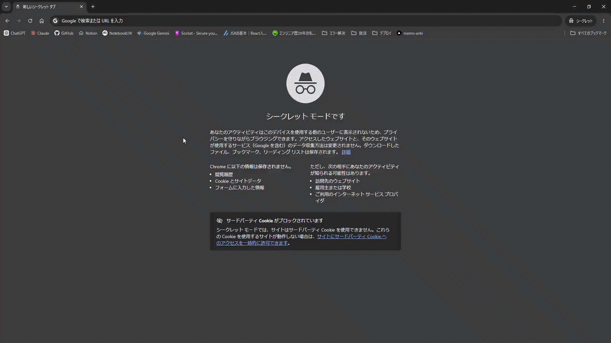
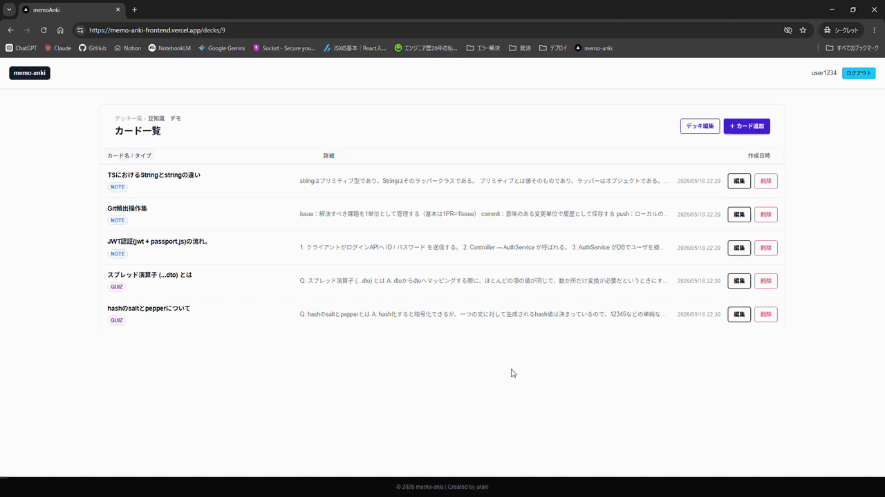
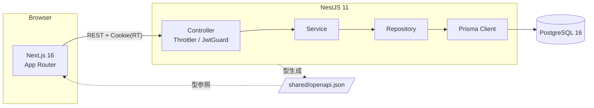
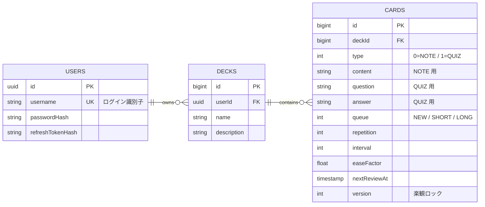

# memoANKI

> **NestJS + Next.js で実装した、SM-2 アルゴリズムによる間隔反復学習 Web アプリ**
> Notion 連携によりメモから問題を一括登録できることが差別化ポイント。
> サイトURL：https://memo-anki-frontend.vercel.app/ （デモユーザはuser1234,user1234でログイン）

<details>
<summary><b>開発の背景・課題意識</b></summary>

### 課題

- **メモアプリ（Notion 等）**：情報整理がしやすいが、復習がしにくい
- **Anki**：復習はしやすいが、情報整理とデッキ作成が面倒
- 両方を併用すると、同じ情報整理を二重にする必要がある

### 解決策

メモアプリで整理したメモから自動でデッキを作成する。**メリットとデメリットが逆なもの同士を組み合わせる**発想（ハイブリッド車のモータとエンジンと同じ）。

### なぜ AnkiConnect ではなくクラウド独自実装か

AnkiConnect はローカルインストールが前提で UX が著しく低下し、外部依存により拡張性も損なわれる。そのため Anki の復習機能を自前で再構築した。

</details>

---


---

## デモ

| ログイン → デッキ一覧         | カード復習（SM-2）              |
| ----------------------------- | ------------------------------- |
|  |  |

> **デプロイ済み**：Railway（Backend + PostgreSQL）/ Vercel（Frontend）
> ※ Notion 連携実装前までの機能をデプロイ中。Notion 連携完了後に再デプロイ予定。

**デモ用アカウント username: user1234 ,password: user1234 ※自由に操作してください**

---

## 主な機能

- **JWT + RefreshToken 認証** — 短命 AT + Cookie 保管 RT、401 検知で自動リフレッシュ＆元リクエスト再試行
- **SM-2 アルゴリズム復習** — 間隔反復スケジューリングを自前実装
- **復習キュー制御** — `NEW / SHORT / LONG` の 3 キュー構造で次回学習日時を決定
- **OpenAPI 型共有** — `@nestjs/swagger` で生成した `openapi.json` を `shared/` 経由で FE/BE が共有
- **デッキ / カード CRUD** — カードは `NOTE`（メモ）と `QUIZ`（裏表）を `type` カラムで切替
- **Notion 連携**（実装中）— OAuth 認証まで実装済み、メモ → カード自動生成は開発中

---

## 技術スタック

| レイヤ       | 採用技術                                                                                                      |
| ------------ | ------------------------------------------------------------------------------------------------------------- |
| **Backend**  | TypeScript 5.7 / NestJS 11 / Prisma 6 / PostgreSQL 16 / Passport-JWT / class-validator / Vitest 4             |
| **Frontend** | Next.js 16 (App Router) / React / TanStack Query 5 / Zustand 5 / Tailwind CSS 4 / DaisyUI 5 / react-hook-form |
| **共通**     | OpenAPI (`@nestjs/swagger`) を `shared/` で型共有 / npm workspaces                                            |
| **インフラ** | Docker / docker-compose / GitHub Actions（BE・FE 分離 CI）                                                    |
| **デプロイ** | Railway（Backend + PostgreSQL）/ Vercel（Frontend）                                                           |

---

## アーキテクチャ



**Controller → Service → Repository → Prisma** のシンプルなレイヤード構造。本PJでは DB を入れ替える予定はなく、Vitest のモック機能も十分強力なため、**Repository Interface による依存逆転は採用していない**。クリーンアーキテクチャも小規模では過剰と判断した。

---

## ER 図



> `type` を immutable にする理由：NOTE と QUIZ は入力構造が根本的に異なるため、変更を許すと既存データの整合性が崩れる。

---

## セットアップ

```bash
# 1. リポジトリ取得
git clone https://github.com/Shin0005/memo-anki.git && cd memo-anki

# 2. 環境変数（backend/.env.example をコピーして編集）
cp backend/.env.example backend/.env

# 3. 起動（Backend / Frontend / DB を一括）
docker compose up -d

# 4. DB マイグレーション
docker compose exec backend npx prisma migrate deploy
```

| URL                            | 用途           |
| ------------------------------ | -------------- |
| http://localhost:3000          | Frontend       |
| http://localhost:3001/api      | Backend (REST) |
| http://localhost:3001/api/docs | **Swagger UI** |

### テスト実行

```bash
# Backend
docker compose exec backend npm test
# Frontend
docker compose exec frontend npm test
```

---

## API 一覧

OpenAPI 仕様の正本は `shared/openapi.json`。Swagger UI（`/api/docs`）でインタラクティブに確認できます。

| Method       | Path                       | 概要                                               |
| ------------ | -------------------------- | -------------------------------------------------- |
| POST         | `/api/auth/register`       | ユーザー登録                                       |
| POST         | `/api/auth/login`          | ログイン（AT 返却 + RT を HttpOnly Cookie に保存） |
| POST         | `/api/auth/refresh`        | RT 検証 → AT 再発行                                |
| POST         | `/api/auth/logout`         | RT 失効                                            |
| GET / POST   | `/api/deck`                | デッキ一覧 / 作成                                  |
| PUT / DELETE | `/api/deck/:deckId`        | デッキ更新 / 削除                                  |
| GET / POST   | `/api/card`                | カード一覧 / 作成                                  |
| PUT / DELETE | `/api/card/:cardId`        | カード更新 / 削除                                  |
| GET          | `/api/card/review`         | 復習キュー取得                                     |
| POST         | `/api/card/:cardId/review` | 自己評価を送信し SM-2 で次回日時を計算             |

---

## ディレクトリ構成

```
memo-anki/
├── backend/             # NestJS（API）
│   ├── src/
│   │   ├── auth/        # JWT + RefreshToken
│   │   ├── deck/        # デッキ CRUD
│   │   ├── card/        # カード CRUD + SM-2 + 復習キュー
│   │   └── common/      # decorators / filters / pipes
│   └── prisma/          # schema.prisma & migrations
├── frontend/            # Next.js 16（App Router）
│   ├── app/             # ルーティング（login / main）
│   ├── features/        # auth / deck / card / review（機能単位）
│   └── lib/             # API クライアント（401 再試行）
├── shared/              # openapi.json と生成型（FE/BE 共有）
├── docs/                # ADR / 試験項目表等
└── docker-compose.yml
```

`features/` は機能単位で `components / hooks / lib` を束ねる構造。横断的な共有は `lib/` に閉じ込めている。

---

## 技術選定の理由

| 採用                            | 理由                                                                                                                      |
| ------------------------------- | ------------------------------------------------------------------------------------------------------------------------- |
| **NestJS**                      | TypeScript で FE/BE の型を OpenAPI 経由で共有でき、二重定義を排除できる。DI / モジュール構造は Spring Boot 経験を活かせる |
| **Prisma**                      | 型安全な ORM。TypeORMほど柔軟性を必要としないため開発速度を優先                                                           |
| **Zustand + TanStack Query**    | サーバー状態（キャッシュ・再フェッチ）は TanStack、JWT等は Zustand と責務を分離。Redux は過剰                             |
| **OpenAPI 型共有 (zod 不採用)** | NestJS が DTO から OpenAPI を自動生成できるため、FE 側でスキーマを二重定義する必要が無い。                                |
| **DaisyUI**                     | Tailwindと相性がよく完成度の高いコンポーネントをそのまま活用でき、開発速度を優先できるため                                |
| **Vitest 統一**                 | BE/FE で同一ランナー。Jest と互換 API で学習コストが低い                                                                  |
| **Repository Interface 不採用** | Node.js では DB 入れ替えは現実的でなく、Vitest のモックも強力。依存逆転は過剰と判断し、実装クラス直結で保守性を優先       |

---

## 工夫したポイント

- **JWT + RT の自動リフレッシュ**
  `lib/api/client.ts` 共通経路で 401 をフックし、RT で AT を更新 → 元リクエストを再試行。全 API 呼び出しに適用。
- **復習ロジックを純粋な関数として実装**
  `card/sm2.ts` `card/apply-rating.ts` を副作用ゼロに保ち、`*.spec.ts` でアルゴリズムだけを単体テスト。
- **復習キュー（NEW / SHORT / LONG）の優先度ソート**
  `sort-review-queue.ts` で並び順を関数化。ストレージから取り出した直後にソート、UI 側は順序を意識しない。
- **`BigInt` の API 越境問題**
  Prisma の `BigInt` を `string` 化して返却し、フロントの JSON シリアライズ事故を防止。
- **楽観ロック (`version` 列)**
  復習中の同時更新で進捗が消えないよう、Card に version を保持し更新時に検査。
- **OpenAPI による型共有**
  `shared/openapi.json` から生成した型を FE が import。zod による二重バリデーションを廃止して保守コストを削減。

---

## テスト戦略

BE は **アルゴリズム / Repository / Controller** を網羅。FE は **副作用が大きい経路** に絞った。

| 対象例                               | テスト内容例                                              |
| ------------------------------------ | --------------------------------------------------------- |
| `card/sm2.ts`                        | スコア別の interval / easeFactor 遷移                     |
| `card/apply-rating.ts`               | キュー遷移と次回復習日時                                  |
| `auth.service`                       | パスワードハッシュ・RT 失効・再発行                       |
| `lib/api/client.ts` (FE)             | 401 → RT で AT 更新 → 元リクエスト再試行                  |
| `useReviewQueue` / `mergeQueue` (FE) | 復習キュー結合の中核ロジック                              |
| `CardCreateModal` (FE)               | `isQuiz` トグル時のフィールド切替と submit バリデーション |

網羅性ではなく**優先順位**を意識。表示専用コンポーネントや構造が同じ Mutation hook は省略。

---

## ADR例

<details>
<summary><b>復習ロジックのテーブル設計</b></summary>

## 背景

カード機能が完成して復習機能に必要なパラメータをカードテーブルに配置するか、新たに復習テーブルを作ってそこに配置するかの検討する必要があった。

## 結論

復習パラメータはカードテーブルに作成する。

## 理由

- 実装がシンプルだから
- SM-2からほかのアルゴリズムへ変更する予定がないから

## 他の案

復習テーブルを新たに作る
→カード単体の機能と復習の機能を分離でき、依存を減らすことができる。
しかし、新たなmodule、新たなテーブルと作成するコストが大きいため不採用。

## 影響

- 復習ロジックとカードが密結合なため、後からほかのアルゴリズムに変更することは難しい。最悪ユーザが蓄積したカードのデータおよび復習のデータを全消去する必要がある。
- 開発工数が減る
- カードと復習ロジックが密結合になる

## 補足

復習テーブルを作ってほかアルゴリズムへの変更を簡単にすることを考えたが、工期が短いうえ、ポートフォリオなのでアルゴリズム入れ替えをすることはないと割り切った。

---

</details>

<details>
<summary><b>AuthとUserの責務分離および依存管理方針</b></summary>

## 結論

AuthはUserを参照する一方向依存とし、専用typeによる型共有を行い、DTOの直接共有は行わない。

## 理由

・責務分離により変更容易性とテスト容易性を確保するため

・DTO共有による双方向依存（実質的な逆依存）を防ぐため

・User変更の影響範囲をAuthへ波及させにくくするため

## 他の案

・UserとAuthを完全に疎結合（相互非依存）にする

→ 過剰設計でコストがかかるため不採用

・AuthがUserのDTOを直接利用

→ DTO変更の影響がAuthに波及し、余計なUserの情報が混じることにより、必要以上にUser内部へ結合してしまう不採用

## 影響

・依存方向がAuth→Userで明確に維持される

・User変更の影響範囲が局所化される

## 補足

AuthServiceはUserServiceのメソッドを利用するが、引数はプリミティブで受け渡す

複雑化した場合のみ、User側に限定した構造型（type）を定義し最小限公開とすることで、依存の波及を抑制する

</details>

`その他は/docsに記載`

## 今後の展望

- [x] Railway + Vercel への本番デプロイ（Notion 連携前まで完了）
- [x] Notion OAuth 認証
- [ ] Notion メモ → カード自動 import（DB 選択・ページング取得・差分インポート）
- [ ] 復習ロジックを Go で書き換え（学習目的）

---
