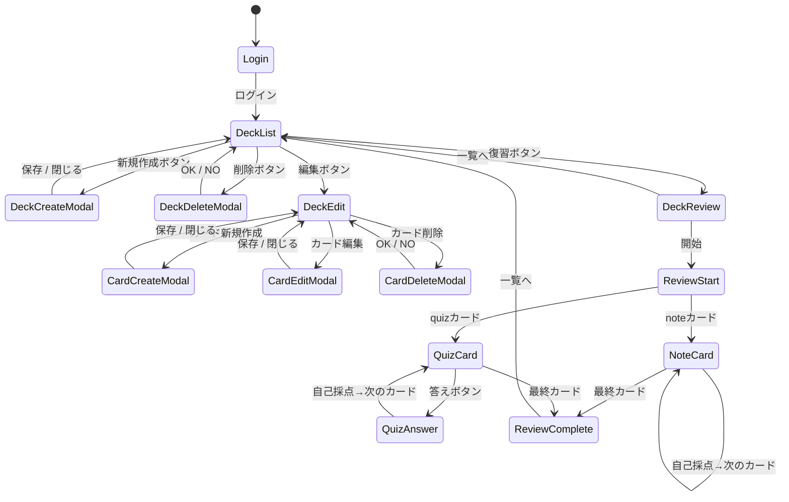

# memoANKI プロジェクト概要

## プロジェクト概要

エビングハウスの忘却曲線に沿ったタイミングで問題・メモを表示する暗記サポートアプリ。
Notion連携によりメモから問題を一括登録できることが差別化ポイント。

---

## プロジェクト発案の背景

### 課題

- **メモアプリ（Notion等）**：情報整理がしやすいが、復習がしにくい
- **Anki**：復習はしやすいが、情報整理とデッキ作成が面倒
- 両方を併用すると、同じような情報整理作業を二重にしなければならない

### 解決策

メモアプリで整理したメモから自動でデッキを作成する。

「メリットとデメリットが逆なもの同士を組み合わせる」という発想で、情報整理しやすく復習もしやすいシステムを目指す。

（例：ハイブリッド車のモータとエンジン、それぞれの得意領域を組み合わせる発想と同じ）

### 独自性

AIで内容解析→問題生成→Anki登録というワークフローを持つサービスは存在するが、

**メモアプリからデッキ作成するサービスはまだ存在しない**。独自の領域として開発できると判断した。

### なぜAnkiに依存しないクラウド独自実装にしたか

Ankiとの連携にはローカルインストールが前提のAnkiConnectが必要となり、UXが著しく低下する。

また、Ankiへの依存は外部サービスに縛られることを意味し、拡張性が損なわれる。

そのため、Ankiの復習機能を自前で再構築し、独自のクラウドサービスとして提供する方針に切り替えた。

---

## 開発者の背景

- 現在23歳、CS学部25卒
- 資格：基本情報技術者
- 現職：大規模公共系システムのバッチ処理担当（Java/Spring/レガシー環境）
- 経験工程：詳細設計〜結合試験
- Web系経験：なし
- 前作ポートフォリオ：Engineary（SpringBoot + VanillaJS）でWeb基礎を習得済み
    - レイヤードアーキテクチャ・責務分離・MockMvc+Mockitoテストを実装済み

---

## 技術スタック

### インフラ

| 用途 | 技術 |
| --- | --- |
| コンテナ | Docker / docker-compose |
| CI | GitHub Actions（Backend / Frontend 分離） |
| デプロイ（予定） | Railway（Backend+DB）+ Vercel（Frontend） |

### バックエンド（注力領域）

| 用途 | 技術 |
| --- | --- |
| 言語/FW | TypeScript / NestJS v11 |
| ORM | Prisma v6 |
| DB | PostgreSQL 16 |
| 認証 | @nestjs/jwt + Passport |
| バリデーション | class-validator |
| テスト | Vitest + Supertest |
| APIドキュメント | @nestjs/swagger |

### フロントエンド（最低限）

| 用途 | 技術 |
| --- | --- |
| FW | Next.js 16（App Router） |
| UIコンポーネント | DaisyUI |
| 状態管理 | Zustand |
| サーバー状態 | TanStack Query |
| スタイリング | Tailwind CSS |
| *フォーム | react-hook-form |

---

## アーキテクチャ

クリーンアーキテクチャを意識したレイヤードアーキテクチャを採用。

### 採用理由

- 小規模のためクリーンアーキテクチャは過剰（ファイル数増加・開発速度低下）
- 完全な依存排除は不要。部分的な依存逆転で十分
- 外部連携（Notion等）の拡張性が必要 → Repositoryをinterfaceで抽象化することで解決

```
Controller → Service → Repository Interface
                              ↓
                   PostgreSQL実装 / Notion実装
```

---

## Docker構成

bind mountを使用し、コード実行環境（Backend・Frontend）とDBをすべてコンテナ内に置く構成。

### 開発用

```bash
docker compose -f docker-compose.yml up -d
```

- ホストのコードをコンテナにマウントし、コンテナ内でホットリロード

### 本番・デモ用（未完成）

```bash
docker compose up
```

---

## 開発手法

### Git運用：GitHub Flow

```
main
└── feature/deck-crud
    └── add-deck-controller
    └── add-deck-service
```

- mainへの直pushは禁止。必ずPRを作る
- IssueにブランチをひもづけてPRを作業単位に分割し、コミットログを整理する
- コミットはConventional Commits形式（feat: / fix: / refactor: / ci: / style:）

### タスク管理：GitHub Issues

- IssueはGitHub Issuesで管理し、コード・タスク・PRを同じ場所で紐づける

### ドキュメント管理（未配置）

`docs/` 配下に構成図、ER図、API定義、ADR等を管理。完成次第配置。

※ドキュメントはNotionで管理している

---

## 機能一覧

### コア機能

| 機能 | 概要 |
| --- | --- |
| デッキCRUD | カードをまとめる機能 |
| カードCRUD | type: NOTE（ノート表示）/ QUIZ（裏表形式）で復習 |
| 認証 | JWT（アクセストークン+リフレッシュトークン） |
| カード復習 | CardModule内に配置。状態はカードに持たせる |
| Notion連携 | Notionからメモをimportしてデッキ（カード）を作成 |

※カードと復習ロジックでModuleを分けなかった理由：復習Moduleにカードの状態を持たせる構造にすることでカードと復習ロジックを切り離すことができ、FSRSなどのアルゴリズムを導入しやすくなる。しかし、実装のコストが大きく増えるため、短期間で作るポートフォリオであることを考えて不採用にした。

### 復習ロジック

SM-2アルゴリズムを採用。
SM-2はAnkiでも採用実績があり、間隔反復の標準的な実装として広く知られているため、独自実装より信頼性が高く学習コストも低い。

### Notion連携（詳細未定）

- OAuth認証でNotionワークスペースにアクセス
- DB一覧取得 → カラム選択 → ノート一覧取得
- 10件ずつページング取得（TanStack Query useInfiniteQuery）
- ImportProviderインターフェースで他サービスにも拡張可能

---

## Aggregate設計

Deck / Card / User をそれぞれ独立したAggregate Rootとして設計。
復習の中心はCardであり、DeckはCardの分類タグに過ぎないという思想から、Cardを主体に独立させた。
NoteとQuizはCardテーブルのカラム（type）として持たせ、JOINを不要にした。

### テーブル定義

### decks

| **カラム** | **型** | **備考** |
| --- | --- | --- |
| id | BIGINT | PK |
| user_id | UUID | FK |
| deck_name | VARCHAR |  |
| deck_explanation | TEXT |  |
| created_at | TIMESTAMP |  |
| updated_at | TIMESTAMP | cardを編集した際に更新しない |

> cardを編集した際にupdated_atを更新はしない理由：あれば便利だが、必要不可欠でもないためコスパが低いと判断。
> 

### cards

| カラム | 型 | 備考 |
| --- | --- | --- |
| id | BIGINT | PK |
| deck_id | BIGINT | FK |
| type | INT | 0=NOTE / 1=QUIZ（immutable） |
| content | TEXT | typeがNOTEのとき使用、QUIZはNULL |
| question | TEXT | typeがQUIZのとき使用、NOTEはNULL |
| answer | TEXT | typeがQUIZのとき使用、NOTEはNULL |
| queue | INT | NEW / SHORT / LONG |
| repetition | INT | 連続成功回数 |
| interval | INT | 時間までの日数 |
| easeFactor | FLOAT | 難易度係数 |
| nextReviewAt | TIMESTAMP | 次回復習日時 |
| version | INT | 複数ワーカー対策 |
| created_at | TIMESTAMP |  |
| updated_at | TIMESTAMP |  |

> typeをimmutableにする理由：NOTEとQUIZは入力構造が根本的に異なるため、途中で変更すると既存データの整合性が崩れる。変えたい場合は削除して再作成させることでデータの一貫性を保つ。
> 

### users

| カラム | 型 | 備考 |
| --- | --- | --- |
| id | UUID | 内部識別子（PK） |
| email | VARCHAR | ログイン用識別子（外部識別子） |
| password_hash | VARCHAR |  |
| refreshTokenHash  | TEXT |  |
| refreshTokenExpiresAt | TIMESTAMP | RTの有効期限 |
| created_at | TIMESTAMP |  |
| updated_at | TIMESTAMP |  |

> 内部識別子（id）とログイン用識別子（email）を分ける理由：メールアドレスが変更された場合でも、他テーブルへの影響をなくすため。拡張性（例：SNSログイン追加）に備えた設計。
> 

---

## 画面フロー

### 画面一覧

- ログイン画面
- デッキ一覧画面
- デッキ編集画面（カード一覧）
- デッキ復習画面

### 状態遷移図（Mermaid）



### 設計上の補足

- カード新規作成・編集モーダルは `type` によって表示フィールドを動的に切り替える（NOTE: content欄のみ / QUIZ: question + answer欄）
- プレビュー機能は工数削減のため実装しない
- Notion連携ボタンはデッキ編集画面に配置。詳細フローは基本機能実装後に設計

---

## 開発ロードマップ（全8週・約520h）

| Phase | 内容 | 工数 |
| --- | --- | --- |
| Phase1 | 基盤構築（環境・CI・Docker） | 完了 |
| Phase2 | 認証（JWT + RefreshToken + マルチユーザ） | 完了 |
| Phase3 | Deck/Card CRUD（NOTE・QUIZはCardのtype） | BE完了
FE開発中 |
| Phase4 | 復習ロジック（キュー管理・ステート遷移） | 60h |
| Phase5 | Notion OAuth連携・ページング・import | 70h |
| Phase6 | デプロイ・ドキュメント整備 | 50h |
| バッファ | ハマり・リファクタ | 60h |
| Extra | 復習ロジックをGOでリファクタ | 80h |

---

## フォルダ構成
```
memo-anki/
├── .github/
│   └── workflows/
│       └── ci.yml
├── backend/            # NestJS
│   ├── prisma/
│   │   └── schema.prisma
│   ├── src/
│   └── Dockerfile
├── frontend/           # Next.js 16
│   ├── app/
│   └── Dockerfile
├── shared/             # 型定義・共通ロジック
├── docs/               # ADR・設計書
├── docker-compose.yml
├── docker-compose.dev.yml
├── package.json        # npm workspaces設定
└── .gitignore
```
